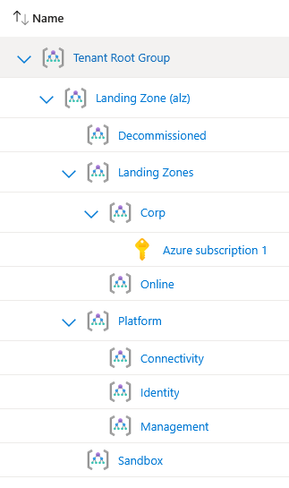

# Lab 01: The Management Group Hierarchy

## Overview

| | |
|---|---|
| **Goal** | Build an Azure landing zone management group hierarchy with Terraform, place my subscription in it, and test how the hierarchy behaves when someone changes it by hand |
| **Runs on** | Azure, at tenant level, with Terraform state in Azure Storage |
| **Cost** | Free. Management groups have no charge |
| **Time** | About 90 minutes, including a sign-in problem caused by mandatory MFA |

A landing zone is the structure and set of rules that an organisation's Azure runs inside. The first part of that structure is the **management group hierarchy**. Management groups sit above subscriptions, and anything assigned to a management group, such as an Azure Policy or a role, is inherited by every management group and subscription beneath it.

I built the hierarchy recommended by Microsoft's Cloud Adoption Framework (CAF), so that Lab 02 can attach policies to it and Lab 03 can place networking in it.



---

## Architecture

```
Tenant Root Group
└── Landing Zone (alz)                      mg-alz
    ├── Platform                            mg-alz-platform
    │   ├── Connectivity                    mg-alz-connectivity   (hub network, Lab 03)
    │   ├── Identity                        mg-alz-identity
    │   └── Management                      mg-alz-management     (logging, Lab 04)
    ├── Landing Zones                       mg-alz-landingzones
    │   ├── Corp                            mg-alz-corp           ← Azure subscription 1
    │   └── Online                          mg-alz-online
    ├── Sandbox                             mg-alz-sandbox
    └── Decommissioned                      mg-alz-decommissioned
```

| Management group | What it is for |
|---|---|
| **Landing Zone (alz)** | The organisation's own top-level group, below the Tenant Root Group. Guardrails that apply to everything are assigned here |
| **Platform** | Shared services run by a central team |
| **Connectivity** | The hub network, firewalls and DNS |
| **Identity** | Domain controllers and identity services |
| **Management** | Central logging and monitoring |
| **Landing Zones** | Where application teams' subscriptions live |
| **Corp** | Internal applications, connected to the corporate network |
| **Online** | Internet-facing applications |
| **Sandbox** | Experiments, with looser rules and no connection to the corporate network |
| **Decommissioned** | Subscriptions being shut down |

Microsoft's reference design also includes a Security group under Platform and a Local group for hybrid workloads. I left those out to keep the lab focused.

### One subscription, playing one role

In a real organisation each of these groups holds its own subscriptions: a connectivity subscription for the hub network, a management subscription for logging, and one subscription per application team. I have a single free trial subscription, so I placed it in **Corp** and treat it as one application team's subscription. Policies assigned higher up the tree, at Landing Zones or Landing Zone (alz), still flow down to it, which is what Lab 02 needs to test.

---

## Following along?

- I ran every command in **PowerShell** on Windows, using the terminal inside **VS Code**.
- Each command is in its own box. Run **one line at a time**.
- Boxes marked **What I saw** show my output. They are not commands to run.
- I have removed my subscription ID and tenant ID from every output. The root management group is named after your tenant ID, so it appears in output often.
- Management groups are **tenant-wide**. If you use a work or school account, check with your administrator first.

See the [main README prerequisites](../README.md#prerequisites) for what to install.

---

## Files in this lab

| File | What it does |
|---|---|
| `providers.tf` | The Terraform and azurerm provider versions |
| `backend.tf` | Stores Terraform state in Azure Storage |
| `variables.tf` | The organisation prefix and where the subscription goes, both with validation |
| `main.tf` | The hierarchy and the subscription placement |
| `outputs.tf` | The names of everything that was built |

### `variables.tf`

```hcl
variable "prefix" {
  description = "Short name for the organisation, used in every management group name"
  type        = string
  default     = "alz"

  validation {
    condition     = can(regex("^[a-z0-9]{2,10}$", var.prefix))
    error_message = "The prefix must be 2 to 10 lowercase letters or numbers."
  }
}

variable "subscription_placement" {
  description = "Which management group the lab subscription is placed in"
  type        = string
  default     = "corp"

  validation {
    condition     = contains(["connectivity", "identity", "management", "corp", "online"], var.subscription_placement)
    error_message = "The subscription must go in connectivity, identity, management, corp or online."
  }
}
```

### `main.tf`

```hcl
# The subscription Terraform is signed in to
data "azurerm_subscription" "current" {}

# The hierarchy, written as data rather than repeated resource blocks
locals {
  # Level 1: directly under the organisation's management group
  level1 = {
    platform       = "Platform"
    landingzones   = "Landing Zones"
    sandbox        = "Sandbox"
    decommissioned = "Decommissioned"
  }

  # Level 2: each one names its parent from level 1
  level2 = {
    connectivity = { display_name = "Connectivity", parent = "platform" }
    identity     = { display_name = "Identity", parent = "platform" }
    management   = { display_name = "Management", parent = "platform" }
    corp         = { display_name = "Corp", parent = "landingzones" }
    online       = { display_name = "Online", parent = "landingzones" }
  }
}

# The organisation's own top-level management group, under the Tenant Root Group
resource "azurerm_management_group" "org" {
  name         = "mg-${var.prefix}"
  display_name = "Landing Zone (${var.prefix})"
}

# Level 1, one management group per entry in local.level1
resource "azurerm_management_group" "level1" {
  for_each = local.level1

  name                       = "mg-${var.prefix}-${each.key}"
  display_name               = each.value
  parent_management_group_id = azurerm_management_group.org.id
}

# Level 2, each placed under the level 1 group it names
resource "azurerm_management_group" "level2" {
  for_each = local.level2

  name                       = "mg-${var.prefix}-${each.key}"
  display_name               = each.value.display_name
  parent_management_group_id = azurerm_management_group.level1[each.value.parent].id
}

# Move the lab subscription into its management group
resource "azurerm_management_group_subscription_association" "lab" {
  management_group_id = azurerm_management_group.level2[var.subscription_placement].id
  subscription_id     = data.azurerm_subscription.current.id
}
```

| Code | What it does |
|---|---|
| `locals { level1 = {...} }` | The hierarchy written as data. Adding a management group means adding one line, not copying a resource block |
| `for_each = local.level1` | Creates one management group per entry. `each.key` is the short name, such as `platform`, and `each.value` is the display name |
| `azurerm_management_group.level1[each.value.parent].id` | Looks up a level 1 group by its key, so `corp` finds `landingzones` as its parent. Terraform works out from this that level 1 must exist before level 2 |
| `data "azurerm_subscription" "current"` | Reads the subscription I am signed in to, so its ID is never written in a file |
| `azurerm_management_group_subscription_association` | Moves the subscription into its group. I did not also set `subscription_ids` on the group, because the two would conflict over the same setting |
| `contains([...], var.subscription_placement)` | Only allows real level 2 names, so a typo is caught before anything reaches Azure |

---

## How I built it

### Step 1: Checked I could work at tenant level

Management groups are created at the level of the whole Microsoft Entra tenant, so I checked my access before writing any code:

```powershell
az account management-group list --output table
```

This failed with an MFA error. See [Issue 1](#1-azure-cli-sign-in-failed-with-an-mfa-error). Once that was fixed:

**What I saw:**

```
DisplayName        Name                TenantId
-----------------  ------------------  ------------------
Tenant Root Group  <tenant-id>         <tenant-id>
```

Only the Tenant Root Group existed, which Azure creates for every tenant and names after the tenant ID. Nothing had been built under it yet.

### Step 2: Rebuilt the state storage

I reused the bootstrap code from [Terraform Lab 04](https://github.com/iM-MQ/terraform-azure-labs/tree/main/lab-04-remote-state) to create the storage account for Terraform state. It stays in place for the whole landing zone project.

```powershell
cd C:\terraform-labs\lab-04-remote-state\bootstrap
```

```powershell
terraform plan -out=tfplan
```

```powershell
terraform apply tfplan
```

**What I saw:**

```
Apply complete! Resources: 4 added, 0 changed, 0 destroyed.

container_name = "tfstate"
resource_group_name = "rg-tfstate-uks"
storage_account_name = "sttfstateeji7qh"
```

### Step 3: Initialised and planned

```powershell
cd C:\azure-landing-zone\lab-01-management-groups
```

```powershell
terraform init
```

```powershell
terraform fmt
```

```powershell
terraform validate
```

```powershell
terraform plan -out=tfplan
```

**What I saw** (shortened):

```
  # azurerm_management_group.level1["decommissioned"] will be created
  # azurerm_management_group.level1["landingzones"] will be created
  # azurerm_management_group.level1["platform"] will be created
  # azurerm_management_group.level1["sandbox"] will be created
  # azurerm_management_group.level2["connectivity"] will be created
  # azurerm_management_group.level2["corp"] will be created
  # azurerm_management_group.level2["identity"] will be created
  # azurerm_management_group.level2["management"] will be created
  # azurerm_management_group.level2["online"] will be created
  # azurerm_management_group.org will be created
  # azurerm_management_group_subscription_association.lab will be created

Plan: 11 to add, 0 to change, 0 to destroy.
```

The plan lists resources alphabetically, but Terraform builds them in dependency order. Each `for_each` instance appears with its key in square brackets.

### Step 4: Built the hierarchy

```powershell
terraform apply tfplan
```

**What I saw** (shortened):

```
azurerm_management_group.org: Creation complete after 25s
azurerm_management_group.level1["sandbox"]: Creating...
azurerm_management_group.level1["platform"]: Creating...
azurerm_management_group.level1["landingzones"]: Creating...
azurerm_management_group.level1["decommissioned"]: Creating...
azurerm_management_group.level1["platform"]: Creation complete after 24s
...
azurerm_management_group.level2["corp"]: Creation complete after 24s
...
azurerm_management_group_subscription_association.lab: Creation complete after 5s

Apply complete! Resources: 11 added, 0 changed, 0 destroyed.
```

Terraform built the organisation group first, then all four level 1 groups **in parallel**, then all five level 2 groups in parallel, and moved the subscription last. Ten management groups took about 75 seconds instead of ten separate waits.

### Step 5: Checked the hierarchy in Azure

I asked Azure for the tree rather than trusting my Terraform output:

```powershell
$tree = az account management-group show --name mg-alz --expand --recurse | ConvertFrom-Json
```

```powershell
$tree.children | ForEach-Object { "$($_.displayName): $(($_.children | ForEach-Object { $_.displayName }) -join ', ')" }
```

**What I saw:**

```
Platform: Connectivity, Management, Identity
Sandbox:
Landing Zones: Online, Corp
Decommissioned:
```

Then I checked the subscription had been placed in Corp:

```powershell
az account management-group show --name mg-alz-corp --expand --query "children[].{Name:displayName, Type:type}" --output table
```

```
Name                  Type
--------------------  --------------
Azure subscription 1  /subscriptions
```

---

## Tests I carried out

### Test 1: A typo in the subscription placement

```powershell
terraform plan -var="subscription_placement=crop"
```

**What I saw:**

```
│ Error: Invalid value for variable
│
│   on variables.tf line 12:
│   12: variable "subscription_placement" {
│     ├────────────────
│     │ var.subscription_placement is "crop"
│
│ The subscription must go in connectivity, identity, management, corp or online.
```

The validation rule stopped the plan and nothing changed in Azure. Without it, a typo could place a subscription in the wrong part of the tree, where different policies apply.

### Test 2: Someone moves the subscription by hand

I simulated a colleague moving the subscription to Sandbox without telling anyone:

```powershell
$subId = az account show --query id -o tsv
```

```powershell
az account management-group subscription add --name mg-alz-sandbox --subscription $subId
```

```powershell
terraform plan
```

**What I saw:**

```
  # azurerm_management_group_subscription_association.lab will be created
  + resource "azurerm_management_group_subscription_association" "lab" {
      + management_group_id = "/providers/Microsoft.Management/managementGroups/mg-alz-corp"
    }

Plan: 1 to add, 0 to change, 0 to destroy.
```

Terraform found the subscription was no longer in Corp and planned to move it back. I applied the fix and confirmed:

```powershell
terraform plan -out=tfplan
```

```powershell
terraform apply tfplan
```

```powershell
terraform plan
```

```
Apply complete! Resources: 1 added, 0 changed, 0 destroyed.

No changes. Your infrastructure matches the configuration.
```

In a landing zone, this kind of drift is a security problem as well as untidiness. A subscription moved into Sandbox quietly falls under different, looser rules. Terraform spotting it and putting it back is the control.

### Test 3: Deleting a management group that is not empty

```powershell
az account management-group delete --name mg-alz-platform
```

**What I saw:**

```
(OK) Cannot delete non-empty management group.
Code: OK
Message: Cannot delete non-empty management group.
```

Azure refused, and Platform still had Connectivity, Identity and Management under it. A management group can only be deleted once it has no child groups or subscriptions, which stops a whole branch of the hierarchy, and the policies attached to it, being removed by one command.

The error reports `Code: OK` even though the delete was refused, so the message, not the code, is what tells you what happened.

---

## Issues I hit and how I fixed them

### 1. Azure CLI sign-in failed with an MFA error

**Symptom.** My first management group command, and then a fresh `az login`, both failed:

```
AADSTS50076: Due to a configuration change made by your administrator, or because you moved to a new location,
you must use multi-factor authentication to access '797f4846-ba00-4fd7-ba43-dac1f8f63013'.
...
No subscriptions found for <my account>.
```

**Investigation.** The account picker opened and I signed in, but the error appeared afterwards, while Azure CLI fetched my subscriptions. That pointed to the step after sign-in, not the sign-in itself.

**Root cause.** Microsoft is enforcing MFA for Azure management, including Azure CLI and infrastructure as code tools. On Windows, `az login` uses Web Account Manager (WAM), which signs in to the account and then requests access to each directory silently in the background. A silent request cannot show an MFA prompt, so it failed.

**Fix.** Signing in to the directory directly forced an interactive sign-in where the MFA prompt could appear:

```powershell
az login --tenant <tenant-id>
```

**Lesson.** MFA is now part of managing Azure from the command line, not just the portal. The account that controls a subscription should always have MFA set up.

---

## Clean up

The hierarchy stays in place, because Lab 02 attaches Azure Policy to it and Lab 03 builds networking inside it. I remove everything at the end of the project with `terraform destroy`, which deletes the management groups from the bottom up and moves the subscription back to the Tenant Root Group.

---

## Command reference

| Command | What it does |
|---|---|
| `az login --tenant <tenant-id>` | Signs in to a specific directory, interactively |
| `az account management-group list` | Lists the management groups you can see |
| `az account management-group show --name <name> --expand --recurse` | Shows a management group and everything beneath it |
| `az account management-group subscription add --name <group> --subscription <id>` | Moves a subscription into a management group |
| `az account management-group delete --name <name>` | Deletes a management group, only if it is empty |
| `terraform plan -var="<name>=<value>"` | Plans with a different value for one variable |

## What I learned

- Management groups sit above subscriptions, and anything assigned to them is inherited by everything beneath. That is what makes them the foundation of a landing zone.
- `for_each` with a map of data keeps a hierarchy readable and easy to extend, and Terraform builds independent resources in parallel.
- Hierarchy drift matters for security: moving a subscription changes which rules apply to it.
- Azure protects the hierarchy itself. A management group cannot be deleted while anything sits beneath it.
- MFA is now required to manage Azure from the command line, and on Windows the sign-in broker needs `--tenant` to show the MFA prompt.

---

## References

Official documentation I used while building and testing this lab.

| What I did | Documentation |
|---|---|
| Learned how management groups, the root group and inheritance work | [What are Azure management groups?](https://learn.microsoft.com/en-us/azure/governance/management-groups/overview) |
| Designed the hierarchy | [Management groups in the Azure landing zone design](https://learn.microsoft.com/en-us/azure/cloud-adoption-framework/ready/landing-zone/design-area/resource-org-management-groups) |
| Moved the subscription and tested deleting a non-empty group | [Manage your Azure subscriptions at scale with management groups](https://learn.microsoft.com/azure/governance/management-groups/manage) |
| Listed, showed and changed management groups from the CLI | [az account management-group](https://learn.microsoft.com/en-us/cli/azure/account/management-group?view=azure-cli-latest) |
| Built the management groups from a map | [for_each meta-argument reference](https://developer.hashicorp.com/terraform/language/meta-arguments/for_each) |
| Added validation to the placement variable | [variable block reference](https://developer.hashicorp.com/terraform/language/block/variable) |
| Understood the MFA sign-in error | [Mandatory multifactor authentication for Azure and admin portals](https://learn.microsoft.com/entra/identity/authentication/concept-mandatory-multifactor-authentication) |
| Fixed the sign-in with `--tenant` | [Sign in with Azure CLI: Web Account Manager](https://learn.microsoft.com/en-us/cli/azure/authenticate-azure-cli-web-account-manager) |